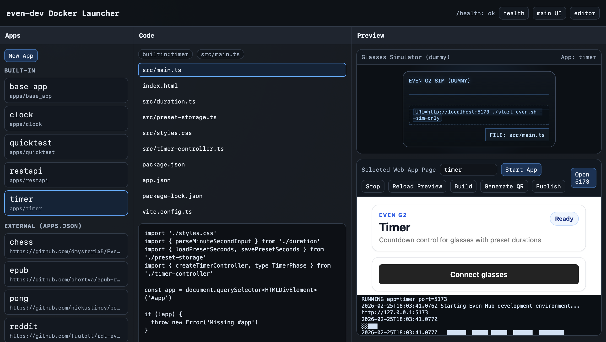

# even-dev Docker WebUI (PoC)



## Purpose

This PoC provides an isolated Docker environment for the `even-dev` web workflow so you can run, preview, and test apps without managing local Node/npm dependencies.

Target workflow (PoC direction):

- app creation (PoC UI scaffolding flow)
- app run/preview in Docker (`:5173`)
- simulator testing (host simulator connected to Docker app)
- real device testing workflow (outside Docker, same app URL flow)
- build / QR / publish to Even Hub workflow (currently UI placeholders in this PoC)

Current limitation:

- The Even Hub Simulator is a **desktop application**
- It is not integrated into Docker in this PoC
- Run the simulator on the **host OS** and connect it to `http://localhost:5173`
- Better integration needs future simulator support (web/headless/remote mode)

## Compose Behavior (default)

`docker compose up --build` starts:

- `landing` on `:8080` (main UI / control panel)
- `editor` on `:5174` (`misc/editor`)

The `landing` service also owns port `:5173` and starts/stops app previews interactively using `start-even.sh --web-only`.

## 1. Build the image

From the repo root:

```bash
docker build -f misc/webui-docker/Dockerfile -t even-dev-webui .
```

## 2. Start the PoC (single container)

This starts the landing page and the interactive app-preview port.

```bash
docker run --rm -it --init \
  -p 8080:8080 \
  -p 5173:5173 \
  -e WEBUI_MODE=landing \
  -v even_dev_workspace:/workspace/even-dev \
  even-dev-webui
```

Open:

- [http://localhost:8080](http://localhost:8080)

Notes:

- The Docker container uses a persistent named volume: `even_dev_workspace`
- Do **not** mount the repo from host (`-v "$PWD":/workspace/even-dev`) because host `node_modules` can break Linux native dependencies

## 3. Start an app from the landing page

In the landing page:

1. Select an app from the left panel (`base_app`, `timer`, etc.)
2. Click `Start App`
3. Wait for runner logs to show the app is running
4. The preview pane should load the app

What happens:

- The landing page runs `./start-even.sh --web-only` in the background
- Port `5173` is used for the app preview

## 4. Stop the app

In the landing page:

1. Click `Stop`

Expected:

- Runner logs show stop/exit messages
- App on `http://localhost:5173` stops responding

## 5. Test with the host Even Hub Simulator

Keep the Docker landing container running.

On the **host OS** (outside Docker), from the `even-dev` repo:

```bash
URL=http://localhost:5173 ./start-even.sh --sim-only
```

This starts only the simulator and connects it to the Docker-hosted app.

## 6. Troubleshooting (quick)

Landing page not visible:

```bash
curl -i http://localhost:8080/health
curl -i http://localhost:8080/
```

App preview not loading:

```bash
curl -i http://localhost:5173/
curl -i http://localhost:8080/api/run/status
curl -i http://localhost:8080/api/preview-html
```

Compose startup shows many `cp: ... File exists` errors:

- Cause: multiple services (`landing`, `editor`) were initializing the same shared workspace volume at the same time
- Fix: this PoC now uses a workspace lock in the entrypoint; rebuild the image and restart Compose

```bash
docker build -f misc/webui-docker/Dockerfile -t even-dev-webui .
cd misc/webui-docker
docker compose up --build
```

If the workspace volume is already in a broken partial state, reset it once:

```bash
docker compose down
docker volume rm even_dev_workspace
docker compose up --build
```

Reset persistent workspace volume (clean start):

```bash
docker volume rm even_dev_workspace
```

## Docker Compose (recommended)

Run the PoC with Docker Compose:

```bash
cd misc/webui-docker
docker compose up --build
```

Open:

- [http://localhost:8080](http://localhost:8080) (landing page / app control)
- [http://localhost:5174](http://localhost:5174) (`misc/editor`)

Note:

- The `landing` service owns port `5173` and starts/stops the app preview interactively
- The `editor` button in the landing page opens `http://localhost:5174`
- Host simulator testing still uses:

```bash
URL=http://localhost:5173 ./start-even.sh --sim-only
```
